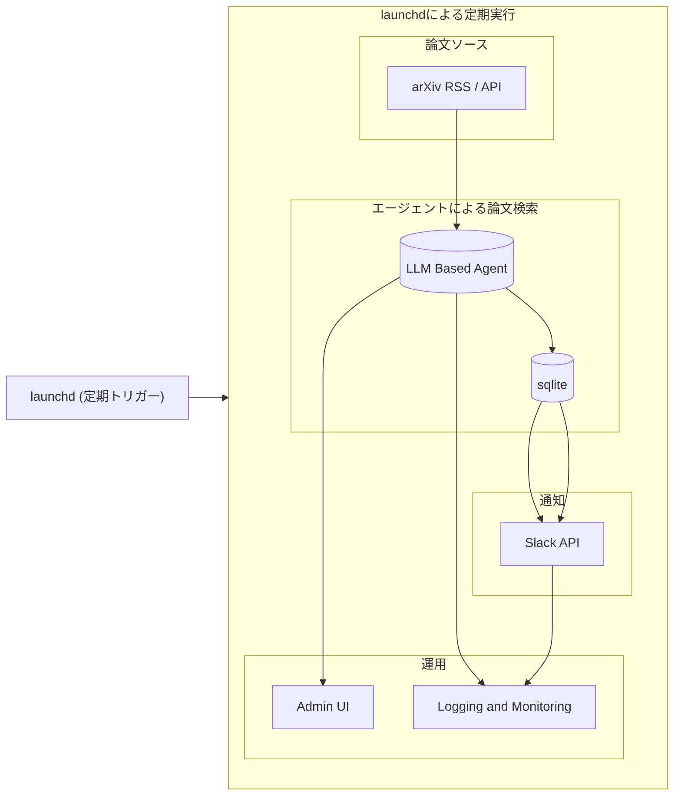

```mermaid
flowchart LR
subgraph Launchd[launchdによる定期実行]

    subgraph Sources[論文ソース]
    arXiv[arXiv RSS / API]
    end

    subgraph Processing[エージェントによる論文検索]
    CacheDB[(sqlite)]
    LLM[(LLM Based Agent)]
    end

    subgraph Notif[通知]
    Slack[Slack API]
    end

    arXiv --> LLM
    LLM --> CacheDB
    CacheDB --> Slack

    subgraph Operators[運用]
    Dashboard[Admin UI]
    Logs[Logging and Monitoring]
    end

    LLM --> Logs
    LLM --> Dashboard
    Slack --> Logs
    CacheDB --> Slack

end

Launchd_start["launchd (定期トリガー)"] --> Launchd
```
